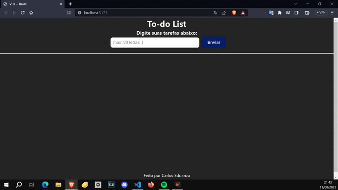
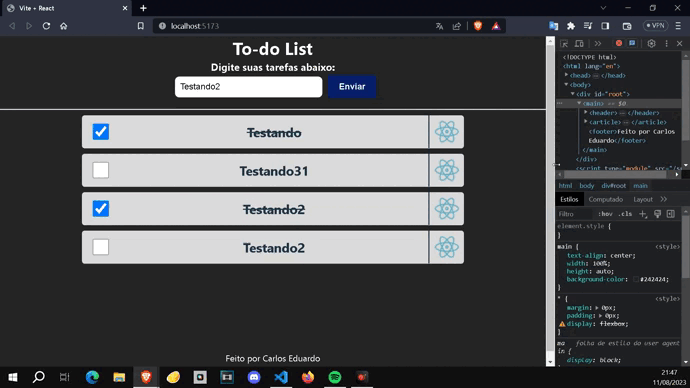

<h1 align="center"> To-Do in React </h1>

Front-end project "To-do list" made in React.js 

  <a href="#🚀-technologies">Technologies</a>&nbsp;&nbsp;&nbsp;|&nbsp;&nbsp;&nbsp;
  <a href="#💻-project">Project</a>&nbsp;&nbsp;&nbsp;|&nbsp;&nbsp;&nbsp;

 

  

## 🚀 Technologies

This project was developed with the following technologies:

- React.js
- Node.js and Vite
- JavaScript, HTML and CSS
- Git and Github

## 💻 Project

Project made with React.js to consolidate important concepts, such as the use of useState and componentization.

- Access the finished project online: https://github.com/Carlos-EduardoAlmeida/To-Do_InReact

# React + Vite

This template provides a minimal setup to get React working in Vite with HMR and some ESLint rules.

Currently, two official plugins are available:

- [@vitejs/plugin-react](https://github.com/vitejs/vite-plugin-react/blob/main/packages/plugin-react/README.md) uses [Babel](https://babeljs.io/) for Fast Refresh
- [@vitejs/plugin-react-swc](https://github.com/vitejs/vite-plugin-react-swc) uses [SWC](https://swc.rs/) for Fast Refresh

---

Made by Carlos Eduardo De Almeida Silva